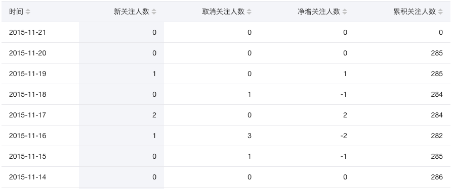
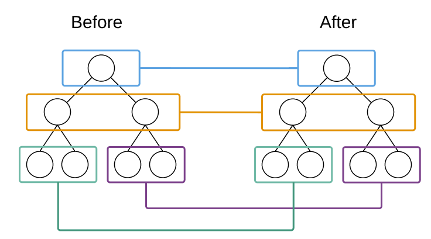

## ReactJS简介
+ React 起源于 Facebook 的内部项目，因为该公司对市场上所有 JavaScript MVC 框架，都不满意，就决定自己写一套，用来架设 Instagram 的网站。做出来以后，发现这套东西很好用，**就在2013年5月开源了**。
+ 由于 React 的设计思想极其独特，属于革命性创新，性能出众，代码逻辑却非常简单。所以，越来越多的人开始关注和使用，认为它可能是将来 Web 开发的主流工具。
+ 中文文档：https://react.docschina.org/


## 前端三大主流框架
+ Angular.js：
+ Vue.js：
+ React.js：


## 分析React
### 开发团队方面
+ React是由FaceBook前端官方团队进行维护和更新的；因此，React的维护开发团队，技术实力比较雄厚；

### 社区方面
+ 在社区方面，React由于诞生的较早，所以社区比较强大，一些常见的问题、坑、最优解决方案，文档、博客在社区中都是可以很方便就能找到的；

### 移动APP开发体验方面
+ React，结合 ReactNative，也提供了无缝迁移到 移动App的开发体验（RN用的最多，也是最火最流行的）；


## 为什么要学习React


## React中几个核心的概念
### 虚拟DOM
 + DOM的本质是什么：
 + DOM和虚拟DOM的区别：
   - 
 - 为什么要实现虚拟DOM：
 - 什么是React中的虚拟DOM：
 - 虚拟DOM的目的：


### Diff算法
 - tree diff:新旧DOM树，逐层对比的方式，就叫做 tree diff,每当我们从前到后，把所有层的节点对比完后，必然能够找到那些 需要被更新的元素；
 - component diff：在对比每一层的时候，组件之间的对比，叫做 component diff;当对比组件的时候，如果两个组件的类型相同，则暂时认为这个组件不需要被更新，如果组件的类型不同，则立即将旧组件移除，新建一个组件，替换到被移除的位置；
 - element diff:在组件中，每个元素之间也要进行对比，那么，元素级别的对比，叫做 element diff；
 - key：key这个属性，可以把 页面上的 DOM节点 和 虚拟DOM中的对象，做一层关联关系；


## React初体验

- CDN方式引入类库
- 本地下载引入
- React基本使用


## JSX语法

1. 如要要使用 JSX 语法，必须使用babel语法转换器；
2. JSX语法的本质：还是以 React.createElement 的形式来实现的，并没有直接把 用户写的 HTML代码，渲染到页面上；
3. 如果要在 JSX 语法内部，书写 JS 代码了，那么，所有的JS代码，必须写到 {} 内部；
4. 当 编译引擎，在编译JSX代码的时候，如果遇到了`<`那么就把它当作 HTML代码去编译，如果遇到了 `{}` 就把 花括号内部的代码当作 普通JS代码去编译；
5. 在{}内部，可以写任何符合JS规范的代码；
6. 在JSX中，如果要为元素添加`class`属性了，那么，必须写成`className`，因为 `class`在ES6中是一个关键字；和`class`类似，label标签的 `for` 属性需要替换为 `htmlFor`.
7. 在JSX创建DOM的时候，所有的节点，必须有唯一的根元素进行包裹；
8. 如果要写注释了，注释必须放到 {} 内部

## 组件化方面

1. 什么是模块化：
2. 什么是组件化：
3. 组件化的好处：

4. React如何实现组件化：

### 第一种基本组件的创建方式

### 父组件向子组件传递数据


### 属性扩散


### 将组件封装到单独的文件中


## React中：第二种创建组件的方式
### 了解ES6中class关键字的使用


### 基于class关键字创建组件
+ 使用 class 关键字来创建组件
```
class Person extends React.Component{
    // 通过报错提示得知：在class创建的组件中，必须定义一个render函数
    render(){
        // 在render函数中，必须返回一个null或者符合规范的虚拟DOM元素
        return <div>
            <h1>这是用 class 关键字创建的组件！</h1>
        </div>;
    }
}
```

## 两种创建组件方式的对比
1. 用构造函数创建出来的组件：专业的名字叫做“无状态组件”
2. 用class关键字创建出来的组件：专业的名字叫做“有状态组件”

> 用构造函数创建出来的组件，和用class创建出来的组件，这两种不同的组件之间的**本质区别就是**：有无state属性！！！
> 有状态组件和无状态组件之间的本质区别就是：有无state属性！

## 一个小案例，巩固有状态组件和无状态组件的使用
### 通过for循环生成多个组件
1. 数据：
```
CommentList = [
    { user: '张三', content: '哈哈，沙发' },
    { user: '张三2', content: '哈哈，板凳' },
    { user: '张三3', content: '哈哈，凉席' },
    { user: '张三4', content: '哈哈，砖头' },
    { user: '张三5', content: '哈哈，楼下山炮' }
]
```

### style样式

## 总结
理解React中虚拟DOM的概念
理解React中三种Diff算法的概念
使用JS中createElement的方式创建虚拟DOM
使用ReactDOM.render方法
使用JSX语法并理解其本质
掌握创建组件的两种方式
理解有状态组件和无状态组件的本质区别
理解props和state的区别

## 相关文章
+ [React数据流和组件间的沟通总结](http://www.cnblogs.com/tim100/p/6050514.html)
+ [单向数据流和双向绑定各有什么优缺点？](https://segmentfault.com/q/1010000005876655/a-1020000005876751)
+ [怎么更好的理解虚拟DOM?](https://www.zhihu.com/question/29504639?sort=created)
+ [React中文文档 - 版本较低](http://www.css88.com/react/index.html)
+ [React 源码剖析系列 － 不可思议的 react diff](http://blog.csdn.net/yczz/article/details/49886061)
+ [深入浅出React（四）：虚拟DOM Diff算法解析](http://www.infoq.com/cn/articles/react-dom-diff?from=timeline&isappinstalled=0)
+ [一看就懂的ReactJs入门教程（精华版）](http://www.cocoachina.com/webapp/20150721/12692.html)
+ [CSS Modules 用法教程](http://www.ruanyifeng.com/blog/2016/06/css_modules.html)
+ [将MarkDown转换为HTML页面](http://blog.csdn.net/itzhongzi/article/details/66045880)
+ [win7命令行 端口占用 查询进程号 杀进程](https://jingyan.baidu.com/article/0320e2c1c9cf0e1b87507b26.html)